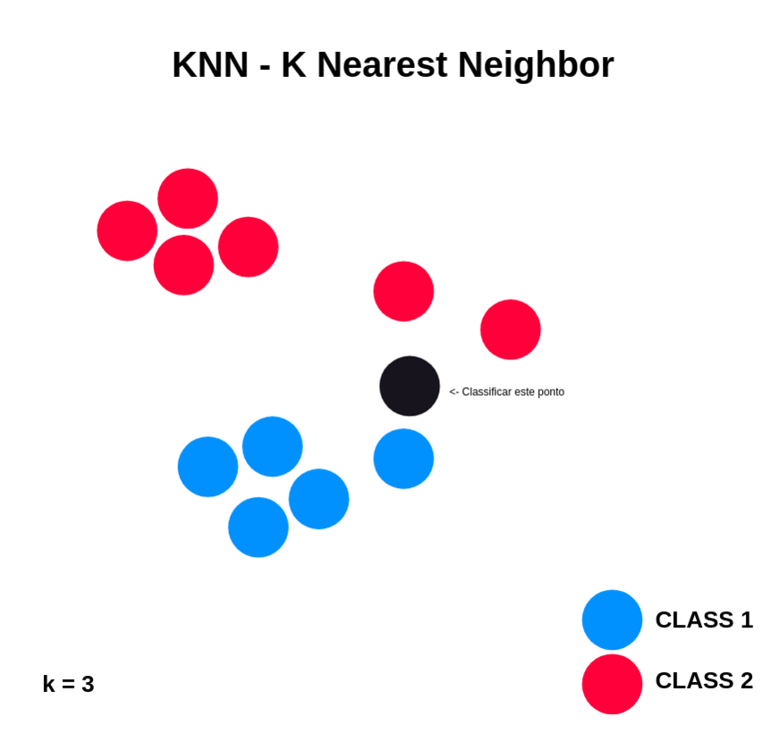

# Machine Learning I
This is the repository for the first assignment of the 'Machine Learning I'  course, which focuses on implementing changes in a machine learning algorithm.

The project is available on GitHub at the following link: [KNN-NearestNeighbourVariation](https://github.com/franciscoribeiro2003/KNN-NearestNeighbourVariation)

Developed by:
- [Beatriz Marques de Sá](https://github.com/beatrizmsa)
- [Francisco Rafael Lima Ribeiro](https://github.com/franciscoribeiro2003)
- [Marta Luísa Monteiro Pereira](https://github.com/martapereira0)


## Nearest Neighbors Algorithm (KNN) variation
In this notebook, is presented the results of a variation of KNN alghorigthm from [this github repository](https://github.com/rushter/MLAlgorithms).

## Goal of the work
The purpose of this work was to:

- Understand how a selected Machine Learning (ML) algorithm works in detail, both theoretically and empirically;
- Understand how benchmarking of ML algorithms is carried out;
- Understand the difference between ML research and the use of ML to solve a specific
application.

## Vulnerability explored
The vulnerability we addressed concerns the sensitivity of the k-Nearest Neighbors (KNN) algorithm to outliers. KNN is a widely used supervised machine learning method for classification and regression tasks, and relies on identifying the k-nearest data points to a query point to make predictions. However, this reliance on distance calculations renders KNN susceptible to outliers, data points significantly differing from the majority.

Outliers can affect KNN's performance by distorting distances used in predictions, particularly when k is small. 

By understanding and mitigating the impact of outliers, we can enhance the overall performance of KNN in handling diverse and noisy datasets.

## Our approach
Our proposed solution to this KNN vulnerability is the assignment of a weight, determined by either the Local Outlier Factor or the Isolation Forest, which are methods used to detect outliers in datasets, during the training phase.

Another modification we propose is to assign varying levels of importance to the k nearest points to the new point during prediction. In other words, points closer to the new one will have a greater "vote" than those farther away.



## Organization of the notebook
- Importing libraries;
- Loading and visualizing data;
- KNN modifications;
- Performing classifications and evaluations;
- Choosing the best hyperparameter;
- Results;

## Requirements
- Python 3.6
- Numpy
- Scipy
- Matplotlib
- scikit-learn
- autograd
- pandas
- pytest

To install the requirements, run:
```bash
pip install -r requirements.txt
```
